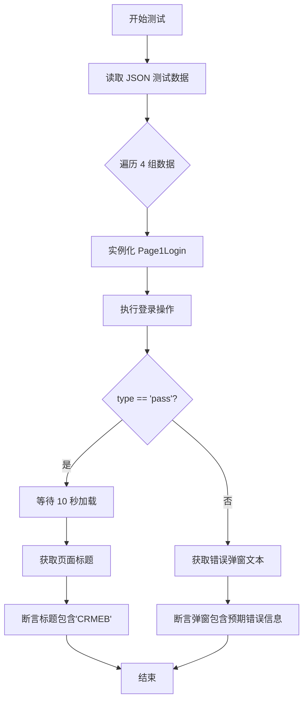
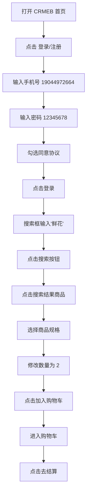

# CRMEB 测试自动化项目搭建说明文档

> **项目名称：** CRMEB 电商前端 UI 自动化测试项目
> **框架：** Playwright + pytest + Allure
> **设计模式：** 页面对象模型（Page Object Model, POM）
> **测试目标：** https://demo25.crmeb.net/ （CRMEB 演示站）

---

## 目录

- [1. 项目概述](#1-项目概述)
- [2. 环境要求](#2-环境要求)
- [3. 项目搭建步骤](#3-项目搭建步骤)
  - [3.1 创建项目目录结构](#31-创建项目目录结构)
  - [3.2 创建虚拟环境 & 安装依赖](#32-创建虚拟环境--安装依赖)
  - [3.3 创建项目配置文件](#33-创建项目配置文件)
  - [3.4 创建数据文件](#34-创建数据文件)
  - [3.5 创建公共工具模块](#35-创建公共工具模块)
  - [3.6 创建页面对象层](#36-创建页面对象层)
  - [3.7 创建测试固件（Fixture）](#37-创建测试固件fixture)
  - [3.8 创建测试用例](#38-创建测试用例)
  - [3.9 运行测试 & 生成报告](#39-运行测试--生成报告)
- [4. 项目结构详解](#4-项目结构详解)
- [5. 各模块详细说明](#5-各模块详细说明)
  - [5.1 config.py — 配置文件](#51-configpy--配置文件)
  - [5.2 pytest.ini — pytest 配置](#52-pytestini--pytest-配置)
  - [5.3 conftest.py — 共享 Fixture](#53-conftestpy--共享-fixture)
  - [5.4 requirements.txt — 依赖管理](#54-requirementstxt--依赖管理)
  - [5.5 common/ 工具模块](#55-common-工具模块)
  - [5.6 data/ 测试数据](#56-data-测试数据)
  - [5.7 page/ 页面对象层](#57-page-页面对象层)
  - [5.8 script/ 测试用例层](#58-script-测试用例层)
  - [5.9 log/ 日志输出](#59-log-日志输出)
  - [5.10 report/ & allure-report/ 测试报告](#510-report--allure-report-测试报告)
- [6. 自动化测试流程说明](#6-自动化测试流程说明)
- [7. 运行指南](#7-运行指南)
  - [7.1 运行所有测试](#71-运行所有测试)
  - [7.2 运行指定测试文件](#72-运行指定测试文件)
  - [7.3 生成 Allure 报告](#73-生成-allure-报告)
  - [7.4 常用 pytest 参数说明](#74-常用-pytest-参数说明)
- [8. 常见问题排查](#8-常见问题排查)

---

## 1. 项目概述

本项目是一个基于 **Playwright** 的端到端（E2E）UI 自动化测试项目，用于测试 **CRMEB** 电商系统前端的核心购物流程。项目采用 **Page Object Model（POM）** 设计模式，将页面元素定位与操作封装到独立的页面类中，测试用例只关注业务逻辑，从而提高代码的可维护性和可复用性。

### 核心测试流程

```
登录 → 搜索商品 → 点击查看商品 → 选择规格 + 加入购物车 → 进入购物车 → 去结算
```

### 使用技术栈

| 技术 | 用途 |
|------|------|
| **Python 3.x** | 编程语言 |
| **Playwright** | 浏览器自动化框架（替代 Selenium） |
| **pytest** | 测试框架，用例组织与执行 |
| **Allure** | 测试报告生成 |
| **Page Object Model** | 设计模式 |
| **JSON** | 测试数据存储 |
| **Logging** | 日志记录 |

---

## 2. 环境要求

- **Python**：3.9 或更高版本
- **操作系统**：Windows / macOS / Linux
- **浏览器**：Chromium（Playwright 内置）
- **IDE 推荐**：PyCharm Professional 或 VS Code

---

## 3. 项目搭建步骤

### 3.1 创建项目目录结构

首先在本地创建一个项目根目录（例如 `crmeb`），并在其中创建如下目录结构：

```
crmeb/                        # 项目根目录
├── common/                   # 公共工具模块目录
├── data/                     # 测试数据目录
├── log/                      # 日志输出目录
├── page/                     # 页面对象目录
├── script/                   # 测试用例目录
├── report/                   # Allure 原始报告数据目录
└── allure-report/            # Allure 生成的 HTML 报告目录
```

使用命令行创建：

```bash
mkdir crmeb
cd crmeb
mkdir common data log page script report allure-report
```

### 3.2 创建虚拟环境 & 安装依赖

```bash
# 创建虚拟环境
python -m venv venv

# 激活虚拟环境（Windows）
venv\Scripts\activate

# 激活虚拟环境（macOS/Linux）
source venv/bin/activate

# 在项目根目录创建 requirements.txt 文件（内容见下文）
# 安装项目依赖
pip install -r requirements.txt

# 安装 Playwright 浏览器内核
playwright install chromium
```

### 3.3 创建项目配置文件

#### `config.py` — 全局配置

```python
import os

URL = 'https://demo25.crmeb.net/'          # 测试目标网址
BASE_PATH = os.path.dirname(os.path.abspath(__file__))  # 项目根目录绝对路径
```

#### `pytest.ini` — pytest 全局配置

```ini
[pytest]
addopts = -s
          --headed
          --slowmo 1000
          --alluredir=report
testpaths = script
python_files = test_*.py
python_classes = Test*
python_functions = test_*
```

配置说明：

| 参数 | 说明 |
|------|------|
| `-s` | 关闭捕获 stdout/stderr，允许在控制台看到 print 输出 |
| `--headed` | 以有头模式运行浏览器（即显示浏览器窗口） |
| `--slowmo 1000` | 每次操作后延迟 1000ms（1秒），便于观察测试过程 |
| `--alluredir=report` | 将 Allure 报告数据输出到 `report/` 目录 |
| `testpaths = script` | 指定测试用例所在的目录 |
| `python_files = test_*.py` | 匹配以 `test_` 开头的 Python 文件 |
| `python_classes = Test*` | 匹配以 `Test` 开头的类 |
| `python_functions = test_*` | 匹配以 `test_` 开头的函数/方法 |

### 3.4 创建数据文件

#### `data/data_login.json` — 登录测试数据

```json
[
  {
    "type": "pass",
    "username": "19044972664",
    "password": "12345678",
    "expect": "CRMEB"
  },
  {
    "type": "fail",
    "username": "19044972664",
    "password": "",
    "expect": "请填写密码"
  },
  {
    "type": "fail",
    "username": "",
    "password": "12345678",
    "expect": "请填写手机号"
  },
  {
    "type": "fail",
    "username": "1",
    "password": "12345678",
    "expect": "手机号"
  }
]
```

数据字段说明：

| 字段 | 说明 |
|------|------|
| `type` | 测试场景类型：`pass`（预期成功）/ `fail`（预期失败） |
| `username` | 登录手机号 |
| `password` | 登录密码 |
| `expect` | 预期结果断言文本 |

测试覆盖场景：
1. ✅ **正常登录** — 正确的手机号和密码，预期页面标题包含 "CRMEB"
2. ❌ **密码为空** — 不输入密码，预期弹窗提示 "请填写密码"
3. ❌ **手机号为空** — 不输入手机号，预期弹窗提示 "请填写手机号"
4. ❌ **手机号格式错误** — 输入过短的手机号，预期弹窗提示包含 "手机号"

### 3.5 创建公共工具模块

所有 `__init__.py` 文件均为空文件，仅用于标识目录为 Python 包。

#### `common/__init__.py`

空文件（目录包标识）。

#### `common/read_login_json.py` — JSON 数据读取工具

```python
import json
from config import BASE_PATH

def get_test_login_data():
    """从 JSON 文件读取登录测试数据，返回元组列表"""
    with open(f'{BASE_PATH}/data/data_login.json', 'r', encoding='utf-8') as f:
        data = json.load(f)
        data_list = []
        for i in data:
            data_list.append((
                i.get('username'),
                i.get('password'),
                i.get('expect'),
                i.get('type')
            ))
    return data_list

if __name__ == '__main__':
    print(get_test_login_data())
```

#### `common/log_config.py` — 日志配置工具

```python
import logging.handlers
from config import BASE_PATH

def log_config():
    """配置并返回日志记录器"""
    logger = logging.getLogger()
    
    # 清除已有的 handler，避免重复添加
    if logger.handlers:
        logger.handlers.clear()
    
    # 设置日志级别为 INFO
    logger.setLevel(logging.INFO)
    
    # 控制器：输出到控制台
    sh = logging.StreamHandler()
    
    # 文件处理器：输出到文件（支持轮转）
    fh = logging.handlers.RotatingFileHandler(
        filename=f'{BASE_PATH}/log/log_test.log',
        maxBytes=1024 * 1024 * 6,  # 每个日志文件最大 6MB
        backupCount=3,             # 保留最近 3 个日志文件
        encoding='utf-8'
    )
    
    # 日志格式
    fmt = '[%(asctime)s] %(filename)s [line:%(lineno)d] %(levelname)s: %(message)s'
    formatter = logging.Formatter(fmt)
    
    fh.setFormatter(formatter)
    sh.setFormatter(formatter)
    logger.addHandler(fh)
    logger.addHandler(sh)
    return logger

if __name__ == '__main__':
    logger = log_config()
    logger.info('开始测试')
```

### 3.6 创建页面对象层

页面对象层（Page Object Layer）是整个自动化框架的核心。每个页面对象类封装了一个页面的**元素定位**和**操作**，测试用例通过调用页面对象的方法来完成业务操作。

**设计原则：**
- 将元素定位器定义为类常量（全大写命名）
- 将操作封装为类方法
- 提供组合方法（如 `login_method()`）供测试用例直接调用
- 通过 `page` 对象与浏览器交互

#### `page/__init__.py`

空文件。

#### `page/page01_login.py` — 登录页面对象

```python
from playwright.async_api import Page
from common.log_config import log_config

# 元素定位常量
LOGIN_BTN = ('link', '登录/注册')
USERNAME_LOGIN_CLICK = '#__layout > div > div > div.loginBg.min_wrapper_1200 > div:nth-child(1) > div.fastLogin.font-color'
PHONE_INPUT = ('textbox', '请输入手机号')
PASSWORD_INPUT = ('textbox', '请输入密码')


class Page1Login:
    """登录页面对象类"""

    def __init__(self, page: Page):
        self.page = page
        self.log = log_config()

    # ========== 元素定位辅助方法 ==========
    def find_by_role(self, role, name):
        """通过 ARIA role 定位元素"""
        return self.page.get_by_role(role=role, name=name)

    def find_locator(self, locator):
        """通过 CSS 选择器定位元素"""
        return self.page.locator(locator)

    # ========== 页面操作方法 ==========
    def login_btn(self):
        """点击「登录/注册」按钮"""
        self.find_by_role(role=LOGIN_BTN[0], name=LOGIN_BTN[1]).click()

    def username_login_click(self):
        """点击「用户登录」标签"""
        self.find_locator(USERNAME_LOGIN_CLICK).click()

    def phone_input(self, phone=None):
        """输入手机号"""
        self.log.info(f'输入手机号{phone}')
        self.find_by_role(role=PHONE_INPUT[0], name=PHONE_INPUT[1]).fill(phone)

    def password_input(self, password=None):
        """输入密码"""
        self.log.info(f'输入密码{password}')
        self.page.get_by_role(role='textbox', name='请输入密码').fill(password)

    def contract_login_click(self):
        """勾选「同意政策」复选框"""
        self.page.locator('#__layout > div > div > div.loginBg.min_wrapper_1200 > div:nth-child(2) > div.isAgree > label > span > span').click()

    def login_click(self):
        """点击「登录」按钮"""
        self.page.locator('#__layout > div > div > div.loginBg.min_wrapper_1200 > div:nth-child(2) > div.signIn.bg-color').click()

    # ========== 组合业务流程 ==========
    def login_method(self, username, password):
        """登录完整流程（按钮点击 → 输入账号密码 → 提交）"""
        self.login_btn()
        self.username_login_click()
        self.phone_input(username)
        self.password_input(password)
        self.contract_login_click()
        self.login_click()
```

#### `page/page02_search_goods.py` — 商品搜索页面对象

```python
from playwright.sync_api import Page

SEARCH_GOODS = ('textbox', '搜索商品')


class SearchGoods:
    """搜索商品页面对象类"""

    def __init__(self, page: Page):
        self.page = page

    def input_goods(self, goods):
        """输入搜索关键词"""
        self.page.get_by_role(role=SEARCH_GOODS[0], name=SEARCH_GOODS[1]).fill(goods)

    def click_goods_search(self):
        """点击「搜索」按钮"""
        self.page.locator('#__layout > div > div:nth-child(1) > div.nav.min_wrapper_1200 > div > div.search.acea-row.row-between-wrapper > div.bnt.bg-color').click()
```

> ⚠️ **注意：** 此处从 `playwright.sync_api` 导入 `Page`，而其他页面类从 `playwright.async_api` 导入。在 pytest-playwright 中 `page` fixture 是同步 API 的，所以建议统一使用 `sync_api`。不过当前框架中实际运行时并未出现冲突，建议统一规范。

#### `page/page03_goods_show.py` — 商品展示页面对象

```python
from playwright.async_api import Page


class GoodsShow:
    """商品展示列表页面对象类"""

    def __init__(self, page: Page):
        self.page = page

    def goods_show(self):
        """点击搜索结果中的第一个商品"""
        self.page.locator('#__layout > div > div:nth-child(2) > div.goodsSearch.wrapper_1200 > div.list.acea-row.row-middle > div > div.info.line2').click()
```

#### `page/page04_goods_info.py` — 商品详情页面对象

```python
from playwright.async_api import Page


class Page04GoodsInfo:
    """商品详情页面对象类"""

    def __init__(self, page: Page):
        self.page = page

    def get_coupon(self):
        """点击领取优惠券"""
        self.page.get_by_role(role='button', name='领取').click()

    def size_choose_a(self):
        """选择商品规格 A"""
        self.page.locator('#__layout > div > div.goods-detail > div.wrapper_1200.acea-row > div.goods-main > div.acea-row.row-top > div.text-wrapper > div.attribute > div > div.acea-row.list > label:nth-child(1) > div > div.acea-row.row-middle.name').click()

    def num_add(self):
        """商品数量加 1"""
        self.page.locator('#__layout > div > div.goods-detail > div.wrapper_1200.acea-row > div.goods-main > div.acea-row.row-top > div.text-wrapper > div.number-wrapper.acea-row > div.counter-wrap > div > button.iconfont.icon-shangpinshuliang-jia').click()

    def num_alter(self, num):
        """修改商品数量为指定值"""
        self.page.locator('#__layout > div > div.goods-detail > div.wrapper_1200.acea-row > div.goods-main > div.acea-row.row-top > div.text-wrapper > div.number-wrapper.acea-row > div.counter-wrap > div > input').click()
        self.page.locator('#__layout > div > div.goods-detail > div.wrapper_1200.acea-row > div.goods-main > div.acea-row.row-top > div.text-wrapper > div.number-wrapper.acea-row > div.counter-wrap > div > input').fill(num)

    def cart_add(self):
        """点击「加入购物车」按钮"""
        self.page.get_by_role(role='button', name='加入购物车').click()

    def cart_enter(self):
        """点击购物车入口图标"""
        self.page.locator('#__layout > div > div:nth-child(1) > div.header.min_wrapper_1200 > div > div > a.cartNum.on').click()
```

#### `page/page05_goto_pay.py` — 购物车结算页面对象

```python
from playwright.async_api import Page


class Page05GotoPay:
    """购物车页面对象类"""

    def __init__(self, page: Page):
        self.page = page

    def goto_pay(self):
        """点击「去结算」按钮"""
        self.page.locator('#__layout > div > div.shoppingCart.wrapper_1200 > div.footer.acea-row.row-between-wrapper > div.acea-row.row-middle > div.bnt.bg-color').click()
```

### 3.7 创建测试固件（Fixture）

#### `conftest.py` — 共享 Fixture 定义

```python
import pytest
from playwright.async_api import Page
from config import URL


@pytest.fixture
def get_page_func(page: Page):
    """获取页面对象 fixture：打开目标网址并返回 page 对象"""
    page.goto(URL)       # 打开 CRMEB 首页
    yield page            # 返回 page 对象供测试用例使用
    page.close()          # 测试结束后关闭页面


@pytest.fixture
def get_alert(page: Page):
    """获取弹窗操作对象 fixture：封装弹窗元素定位"""

    class AlertHelper:
        """弹窗操作辅助类"""

        def __init__(self, page):
            self.page = page

        def text(self):
            """获取错误弹窗的文本内容"""
            return self.page.locator(
                'body > div.el-message.el-message--error.el-message-fade-leave-active.el-message-fade-leave-to > p'
            ).text_content()

    return AlertHelper(page)
```

**Fixture 说明：**

| Fixture 名称 | 用途 | 生命周期 |
|-------------|------|---------|
| `get_page_func` | 打开测试网址，返回 Page 对象 | 每个测试函数调用一次（function 作用域） |
| `get_alert` | 返回弹窗操作助手，用于获取错误提示文本 | 每个测试函数调用一次（function 作用域） |

### 3.8 创建测试用例

#### `script/__init__.py`

空文件。

#### `script/test_login.py` — 登录测试用例

```python
import allure
import pytest
from common.read_login_json import get_test_login_data
from page.page01_login import Page1Login


class TestLogin:
    """登录测试类"""

    @pytest.mark.parametrize('username,password,expect,type', get_test_login_data())
    def test_login(self, get_page_func, username, password, expect, get_alert, type):
        with allure.step('登录测试'):
            self.page01_login = Page1Login(get_page_func)
            self.page01_login.login_method(username, password)

            if type == 'pass':
                # 成功场景：等待页面加载后断言页面标题包含预期文本
                get_page_func.wait_for_timeout(10000)
                title = get_page_func.title()
                assert expect in title
            elif type == 'fail':
                # 失败场景：获取弹窗文本并断言包含预期错误信息
                msg = get_alert.text()
                assert expect in msg
```

**测试内容详解：**

- **参数化：** 使用 `@pytest.mark.parametrize` 配合 `get_test_login_data()` 读取 JSON 中的 4 组测试数据。
- **成功场景 (`type='pass'`)：**
  - 执行登录操作
  - 等待 10 秒让页面加载
  - 获取页面标题
  - 断言标题包含 "CRMEB"
- **失败场景 (`type='fail'`)：**
  - 执行登录操作（错误的输入）
  - 获取浏览器弹窗中的错误提示文本
  - 断言弹窗文本包含预期的错误信息

#### `script/test_main.py` — 端到端购物流程测试

```python
from page.page01_login import Page1Login
from page.page02_search_goods import SearchGoods
from page.page03_goods_show import GoodsShow
from page.page04_goods_info import Page04GoodsInfo
from page.page05_goto_pay import Page05GotoPay


class TestMain:
    """端到端购物流程测试类"""

    def test_main(self, get_page_func):
        """核心购物流程测试：登录 → 搜索 → 查看 → 加购 → 结算"""

        # 1. 实例化所有页面对象
        self.page1_login = Page1Login(get_page_func)
        self.page2_search_goods = SearchGoods(get_page_func)
        self.page03_goods_show = GoodsShow(get_page_func)
        self.page04_goods_info = Page04GoodsInfo(get_page_func)
        self.page05_goto_pay = Page05GotoPay(get_page_func)

        # 2. 登录（使用固定测试账号）
        self.page1_login.login_method('19044972664', '12345678')

        # 3. 搜索商品
        self.page2_search_goods.input_goods('鲜花')
        self.page2_search_goods.click_goods_search()

        # 4. 查看商品详情
        self.page03_goods_show.goods_show()

        # 5. 选择规格和数量
        self.page04_goods_info.size_choose_a()
        self.page04_goods_info.num_alter('2')

        # 6. 加入购物车并进入购物车
        self.page04_goods_info.cart_add()
        self.page04_goods_info.cart_enter()

        # 7. 去结算
        self.page05_goto_pay.goto_pay()
```

**测试流程图示：**

```
 ┌──────────┐     ┌──────────┐     ┌──────────┐     ┌──────────┐     ┌──────────┐
 │  登录     │ ──→ │  搜索     │ ──→ │  查看     │ ──→ │  加购     │ ──→ │  结算     │
 │          │     │  鲜花     │     │  商品     │     │  购物车   │     │          │
 └──────────┘     └──────────┘     └──────────┘     └──────────┘     └──────────┘
  Page1Login     SearchGoods      GoodsShow      Page04GoodsInfo   Page05GotoPay
```

### 3.9 运行测试 & 生成报告

#### 运行测试

```bash
# 运行所有测试（配置已写入 pytest.ini）
pytest

# 运行指定测试文件
pytest script/test_login.py

# 运行指定测试类中的方法
pytest script/test_login.py::TestLogin::test_login

# 无头模式运行（不显示浏览器窗口）
pytest --headed=false
```

#### 生成 Allure 报告

```bash
# 第一步：运行测试生成原始报告数据（已通过 --alluredir=report 配置）
pytest

# 第二步：将原始数据转换为 HTML 报告
allure generate report -o allure-report --clean

# 第三步：打开 HTML 报告
allure open allure-report
```

---

## 4. 项目结构详解

### 完整目录树

```
E:/PY/project/crmeb/
├── config.py                          # 全局配置（URL、路径）
├── conftest.py                        # pytest 共享 fixture
├── pytest.ini                         # pytest 运行配置
├── requirements.txt                   # Python 依赖包列表
│
├── common/                            # 公共工具模块
│   ├── __init__.py                    # 包标识文件（空）
│   ├── log_config.py                  # 日志配置工具
│   └── read_login_json.py             # JSON 数据读取工具
│
├── data/                              # 测试数据目录
│   └── data_login.json                # 登录测试数据（JSON 格式）
│
├── page/                              # 页面对象层（Page Object Model）
│   ├── __init__.py                    # 包标识文件（空）
│   ├── page01_login.py                # P1 - 登录页面
│   ├── page02_search_goods.py         # P2 - 商品搜索页
│   ├── page03_goods_show.py           # P3 - 商品展示页
│   ├── page04_goods_info.py           # P4 - 商品详情页
│   └── page05_goto_pay.py             # P5 - 购物车结算页
│
├── script/                            # 测试用例层
│   ├── __init__.py                    # 包标识文件（空）
│   ├── test_login.py                  # 登录测试
│   └── test_main.py                   # 端到端购物流程测试
│
├── log/                               # 日志输出目录
│   └── log_test.log                   # 运行时日志文件
│
├── report/                            # Allure 原始报告数据
│   └── *.json / *.txt                 # pytest 执行时自动生成
│
└── allure-report/                     # Allure 生成的 HTML 报告
    ├── index.html                     # 报告首页
    ├── data/                          # 报告数据
    ├── widgets/                       # 报告组件
    └── ...
```

### 分层架构说明

本项目采用经典的三层架构：

```
┌─────────────────────────────────────────────────┐
│               测试用例层 (script/)                │
│    test_login.py          test_main.py          │
│         ↑ 调用                ↑ 调用             │
├─────────────────────────────────────────────────┤
│              页面对象层 (page/)                   │
│  Page1Login → SearchGoods → GoodsShow → ...     │
│         ↑ 继承 / 实例化       ↑ 使用工具          │
├─────────────────────────────────────────────────┤
│              公共工具层 (common/)                 │
│    read_login_json.py      log_config.py        │
│         ↑ 读取                ↑ 配置             │
├─────────────────────────────────────────────────┤
│    config.py      data/        pytest.ini       │
│   (配置中心)     (测试数据)    (运行配置)         │
└─────────────────────────────────────────────────┘
```

---

## 5. 各模块详细说明

### 5.1 config.py — 配置文件

**文件路径：** `crmeb/config.py`

```python
import os

URL = 'https://demo25.crmeb.net/'
BASE_PATH = os.path.dirname(os.path.abspath(__file__))
```

| 变量 | 值 | 说明 |
|------|-----|------|
| `URL` | `https://demo25.crmeb.net/` | CRMEB 演示站地址，所有测试的起始页面 |
| `BASE_PATH` | 项目根目录绝对路径 | 用于构建其他文件的绝对路径（如日志文件、数据文件路径） |

### 5.2 pytest.ini — pytest 配置

**文件路径：** `crmeb/pytest.ini`

```
[pytest]
addopts = -s
          --headed
          --slowmo 1000
          --alluredir=report
testpaths = script
python_files = test_*.py
python_classes = Test*
python_functions = test_*
```

### 5.3 conftest.py — 共享 Fixture

**文件路径：** `crmeb/conftest.py`

> `conftest.py` 是 pytest 的特殊文件，其中定义的 Fixture 会自动被同目录及子目录下的所有测试文件共享使用，无需手动 import。

**自定义 Fixture：**

| Fixture | 返回值 | 用途 |
|---------|--------|------|
| `get_page_func(page: Page)` | `page` 对象 | 打开目标 URL，返回 Playwright 的 Page 对象供测试使用 |
| `get_alert(page: Page)` | `AlertHelper` 对象 | 封装错误弹窗的文本获取操作 |

### 5.4 requirements.txt — 依赖管理

**文件路径：** `crmeb/requirements.txt`

**核心依赖：**

| 包名 | 版本 | 用途 |
|------|------|------|
| `playwright` | 1.60.0 | 浏览器自动化框架核心库 |
| `pytest` | 9.0.3 | 测试框架 |
| `pytest-playwright` | 0.8.0 | pytest 与 Playwright 的集成插件 |
| `allure-pytest` | 2.16.0 | Allure 报告生成插件 |
| `pytest-xdist` | 3.8.0 | 分布式测试执行（并行） |
| `pytest-rerunfailures` | 16.3 | 失败用例自动重跑 |

### 5.5 common/ 工具模块

#### `common/read_login_json.py`

一个工具函数，负责：
1. 打开 `data/data_login.json` 文件
2. 解析 JSON 数据
3. 提取每条数据的 `username`、`password`、`expect`、`type` 字段
4. 返回一个元组列表，供 `@pytest.mark.parametrize` 参数化使用

**典型输出：**
```python
[
    ('19044972664', '12345678', 'CRMEB', 'pass'),
    ('19044972664', '', '请填写密码', 'fail'),
    ('', '12345678', '请填写手机号', 'fail'),
    ('1', '12345678', '手机号', 'fail')
]
```

#### `common/log_config.py`

一个日志配置函数，负责：
1. 创建 Logger 实例，设置日志级别为 `INFO`
2. 添加控制台输出 Handler（`StreamHandler`）
3. 添加文件输出 Handler（`RotatingFileHandler`）
   - 日志文件路径：`log/log_test.log`
   - 单个文件最大 6MB
   - 保留最近 3 个文件
4. 设置日志格式：`[时间] 文件名 [行号] 级别: 消息`

**日志格式示例：**
```
[2026-06-12 20:06:57,682] page01_login.py [line:39] INFO: 输入手机号19044972664
[2026-06-12 20:06:58,708] page01_login.py [line:44] INFO: 输入密码12345678
```

### 5.6 data/ 测试数据

**文件路径：** `crmeb/data/data_login.json`

以 JSON 格式存储登录测试的测试数据，包含 4 个测试场景：

| 场景 | type | username | password | expect |
|------|------|----------|----------|--------|
| ✅ 成功登录 | pass | 19044972664 | 12345678 | CRMEB |
| ❌ 密码为空 | fail | 19044972664 | (空) | 请填写密码 |
| ❌ 手机号为空 | fail | (空) | 12345678 | 请填写手机号 |
| ❌ 手机号格式错误 | fail | 1 | 12345678 | 手机号 |

**优势：** 将测试数据与代码分离，修改测试数据无需修改代码，便于扩展和维护。

### 5.7 page/ 页面对象层

每个页面类封装了特定页面的**所有操作**，遵循以下设计规范：

| 页面类 | 对应页面 | 主要操作方法 |
|--------|---------|-------------|
| `Page1Login` | 登录页面 | `login_method(username, password)` — 一键登录 |
| `SearchGoods` | 首页搜索区域 | `input_goods()` / `click_goods_search()` |
| `GoodsShow` | 搜索结果列表 | `goods_show()` — 点击第一个商品 |
| `Page04GoodsInfo` | 商品详情页 | `size_choose_a()` / `num_alter()` / `cart_add()` / `cart_enter()` |
| `Page05GotoPay` | 购物车页面 | `goto_pay()` — 去结算 |

**页面对象设计模式的优势：**
- ✅ **可维护性高：** 页面元素变更只需修改对应的页面类，不影响测试用例
- ✅ **代码复用：** 相同的页面操作可在多个测试用例中复用
- ✅ **可读性强：** 测试用例代码清晰地表达了业务操作流程
- ✅ **低耦合：** 页面对象与测试逻辑分离

### 5.8 script/ 测试用例层

#### `test_login.py` — 登录测试

- **测试类：** `TestLogin`
- **测试方法：** `test_login(get_page_func, username, password, expect, get_alert, type)`
- **测试数据：** 通过 `@pytest.mark.parametrize` 从 JSON 文件读取 4 组数据
- **断言策略：**
  - 成功场景：验证页面标题包含预期文本
  - 失败场景：验证错误弹窗包含预期文本

#### `test_main.py` — 端到端流程测试

- **测试类：** `TestMain`
- **测试方法：** `test_main(get_page_func)`
- **测试流程：** 登录 → 搜索 → 查看 → 加购 → 结算（一次性完成整个购买流程）

### 5.9 log/ 日志输出

**文件路径：** `crmeb/log/log_test.log`

运行测试时自动生成的日志文件，记录了所有关键操作（如输入手机号、输入密码等）。

**轮转策略：**
- 单个日志文件最大 6MB
- 保留最近 3 个历史文件（`log_test.log.1`、`log_test.log.2`、`log_test.log.3`）

### 5.10 report/ & allure-report/ 测试报告

| 目录 | 内容 | 用途 |
|------|------|------|
| `report/` | JSON 格式的原始报告数据 | 由 pytest 执行时自动生成（通过 `--alluredir=report` 参数） |
| `allure-report/` | HTML/JS/CSS 格式的静态报告 | 由 `allure generate` 命令生成，可直接在浏览器中打开查看 |

**生成报告命令：**
```bash
allure generate report -o allure-report --clean
allure open allure-report
```

---

## 6. 自动化测试流程说明

### 登录测试流程



### 端到端购物流程



---

## 7. 运行指南

### 7.1 运行所有测试

```bash
# 直接运行（使用 pytest.ini 中的默认配置）
pytest

# 等价于：
pytest -s --headed --slowmo 1000 --alluredir=report
```

### 7.2 运行指定测试文件

```bash
# 仅运行登录测试
pytest script/test_login.py

# 仅运行端到端购物流程测试
pytest script/test_main.py

# 运行指定测试类
pytest script/test_login.py::TestLogin

# 运行指定测试方法
pytest script/test_login.py::TestLogin::test_login
```

### 7.3 生成 Allure 报告

```bash
# 步骤 1：运行测试（生成原始报告数据到 report/ 目录）
pytest

# 步骤 2：生成 HTML 报告
allure generate report -o allure-report --clean

# 步骤 3：在浏览器中打开报告
allure open allure-report
```

### 7.4 常用 pytest 参数说明

| 参数 | 说明 | 示例 |
|------|------|------|
| `-s` | 显示控制台输出 | `pytest -s` |
| `-v` | 显示详细执行信息 | `pytest -v` |
| `--headed` | 有头模式（显示浏览器窗口） | `pytest --headed` |
| `--headed=false` | 无头模式（不显示浏览器窗口） | `pytest --headed=false` |
| `--slowmo 500` | 操作间隔 500ms | `pytest --slowmo 500` |
| `--alluredir=report` | Allure 报告输出目录 | `pytest --alluredir=report` |
| `-k "关键词"` | 按名称过滤测试用例 | `pytest -k "login"` |
| `--reruns 2` | 失败重跑 2 次 | `pytest --reruns 2` |
| `-n auto` | 并行执行（需安装 pytest-xdist） | `pytest -n auto` |

---

## 8. 常见问题排查

### 8.1 首次运行需要安装 Playwright 浏览器

```bash
# 安装 Chromium 浏览器
playwright install chromium

# 安装所有支持的浏览器
playwright install
```

### 8.2 元素定位失败（StaleElementReference / TimeoutError）

可能原因：
- CSS 选择器变更（页面重新部署或改版）
- 页面加载速度慢，元素尚未出现
- 弹窗覆盖

**解决方案：**
1. 使用 Playwright 的 `locator.wait_for()` 等待元素出现
2. 增加等待时间：`page.wait_for_timeout(3000)`
3. 使用更稳定的定位策略（如 `get_by_role()`、`get_by_text()`）

### 8.3 登录失败

可能原因：
- 测试账号过期或被禁用
- 验证码策略变更
- 网站 URL 变更

**解决方案：**
1. 在 `config.py` 中更新 `URL`
2. 在 `data/data_login.json` 中更新测试账号

### 8.4 Allure 报告不生成

```bash
# 确保已安装 allure-pytest
pip install allure-pytest

# 确保 allure 命令行工具已安装
# Windows（使用 scoop）：
scoop install allure
# macOS（使用 brew）：
brew install allure
```

---

## 附录：快速命令速查表

| 操作 | 命令 |
|------|------|
| 安装依赖 | `pip install -r requirements.txt` |
| 安装浏览器 | `playwright install chromium` |
| 运行全部测试 | `pytest` |
| 运行登录测试 | `pytest script/test_login.py -v` |
| 生成 Allure 报告 | `allure generate report -o allure-report --clean` |
| 打开报告 | `allure open allure-report` |
| 无头模式运行 | `pytest --headed=false` |
| 失败自动重跑 | `pytest --reruns 2` |

---

> **文档版本：** v1.0
> **最后更新：** 2026 年 6 月 12 日
> **维护者：** 项目开发团队
